# Flutter Blog App

This project is a portfolio showcase demonstrating my skills in mobile app development using the Flutter framework and Dart. It incorporates modern state management with Riverpod and Firebase integration for authentication, database, and storage. The app allows users to create, browse, and manage blogs with a rich feature set, simulating a full-fledged blogging platform.

## Project Highlights:

- **User Authentication**: 
  - Integration of Firebase Authentication enabling login via email and Google accounts.

- **Create & Manage Blogs**: 
  - Users can craft rich, styled blogs using an integrated Rich Text Editor and upload them to Firebase under different categories. 
  
- **Search & Filter Blogs**: 
  -  Implemented search functionality that allows users to find blogs based on specific categories or keywords. Users can search for blogs by specific categories or keywords to quickly find relevant content.
  
- **Favorites & PDF Downloads**: 
  - Users can save blogs as favorites, download them as PDF files, and share them with others.

- **Blog Sharing**: 
  - Share blogs directly from the app with others via various platforms.

- **Rich Text Editor**: 
  - The app includes a fully-featured rich text editor to create high-quality, styled blogs for a professional look and feel.

## Tech Stack

- **Flutter (Dart)**: For building the UI and handling the app's core functionality.
- **Riverpod**: For efficient state management.
- **Firebase**: Used for authentication, real-time database (Firestore), and storage.

## Screenshots

  
  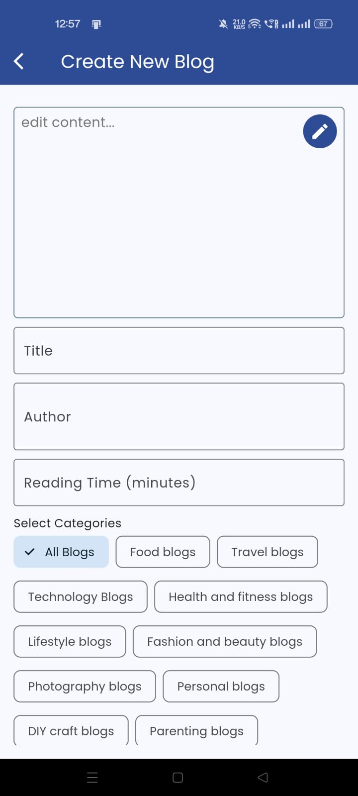
  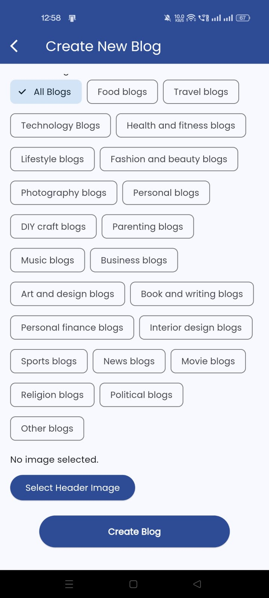
  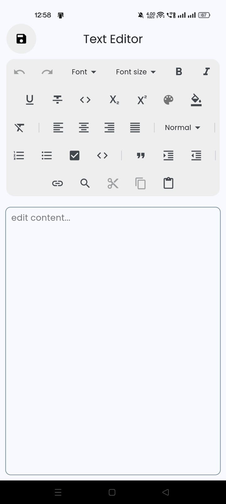
  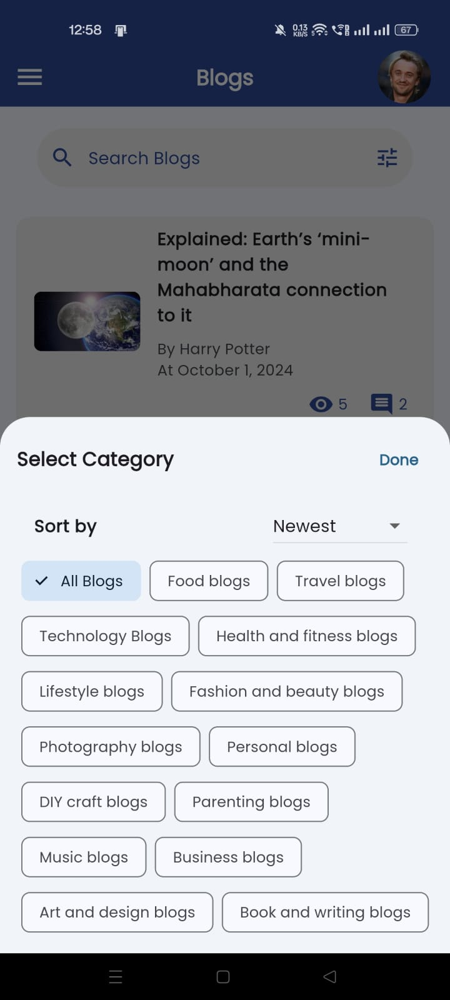
  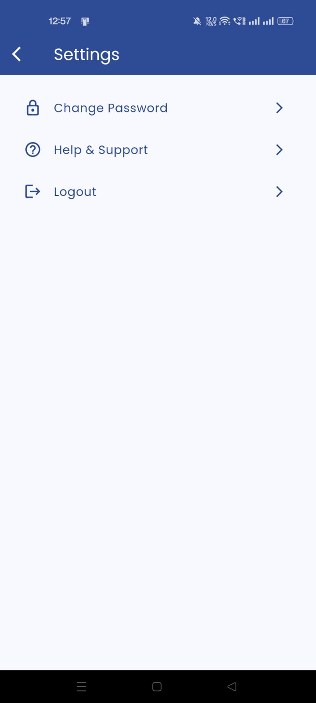
  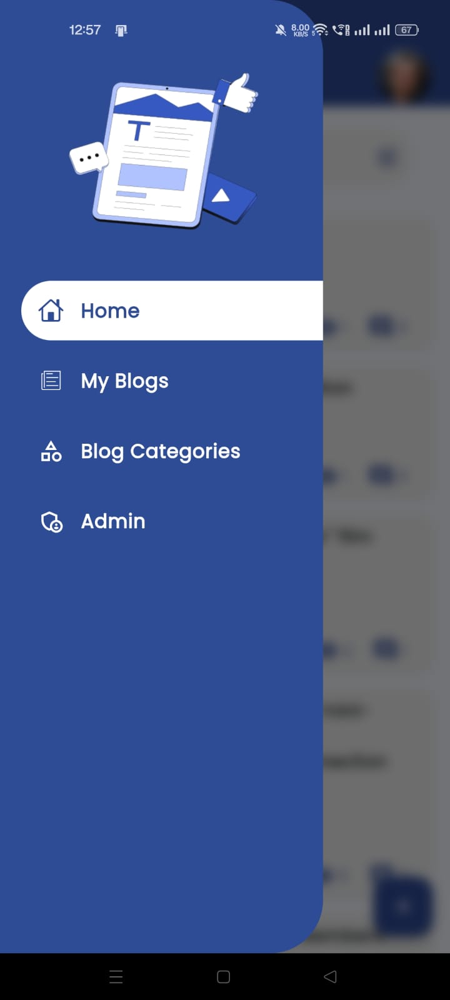
  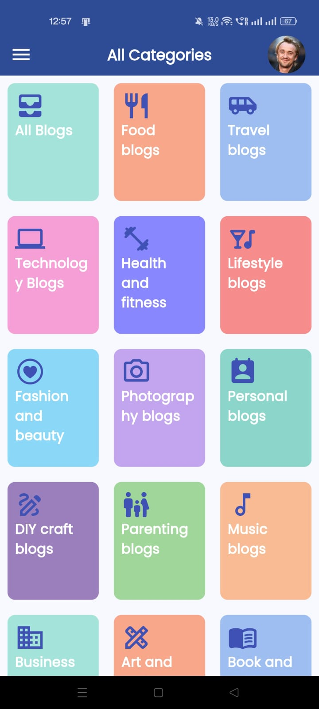
  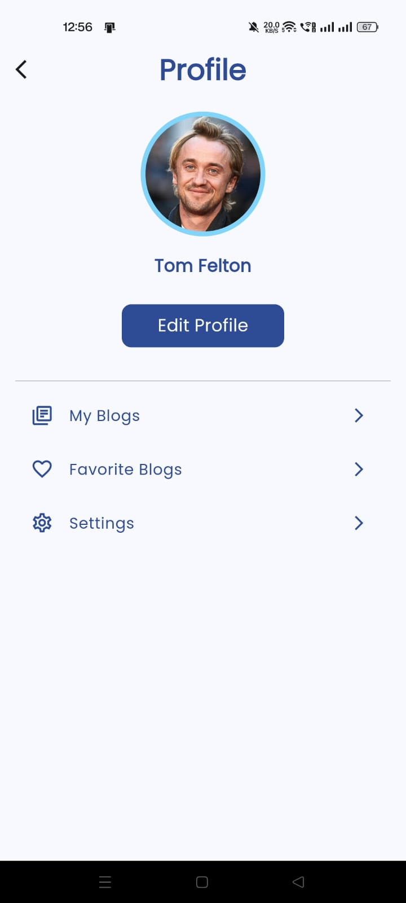
  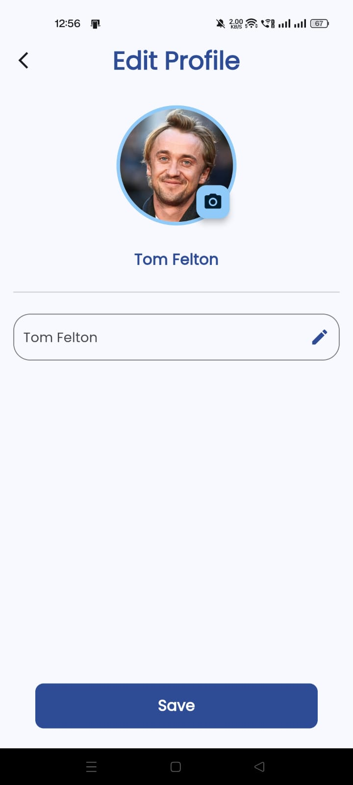
  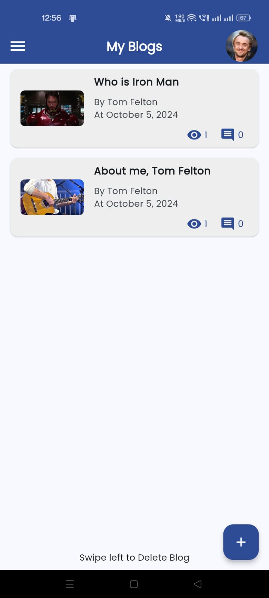
  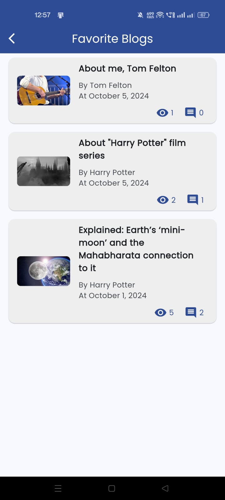
  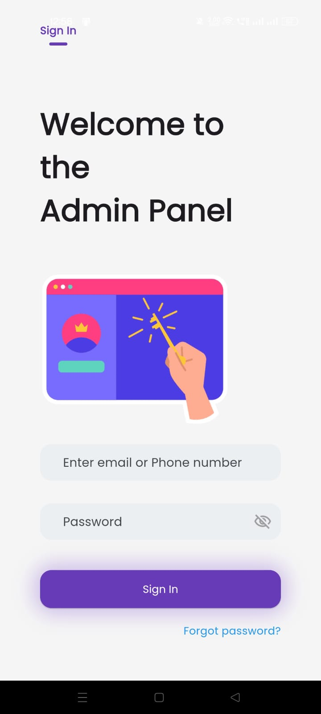

